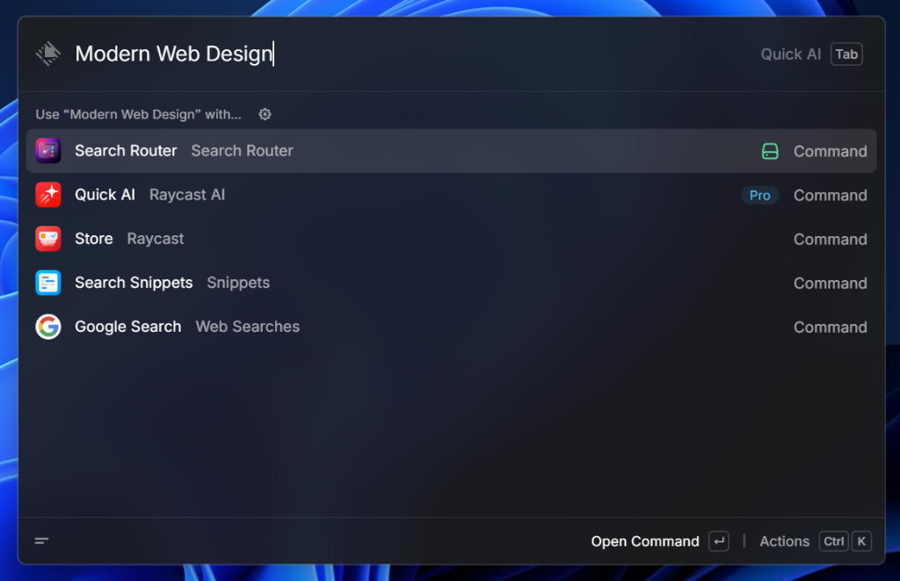
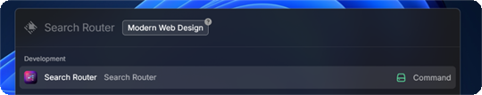
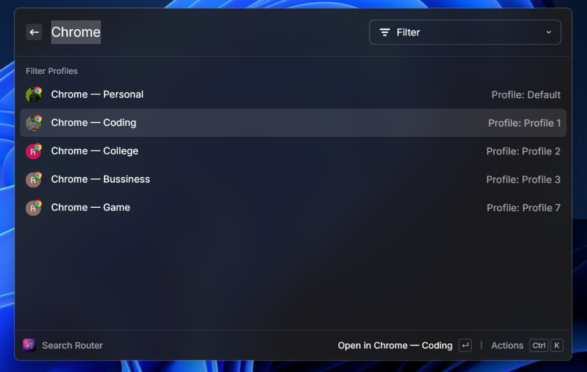
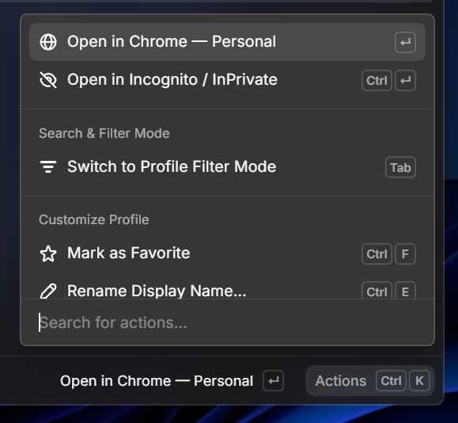
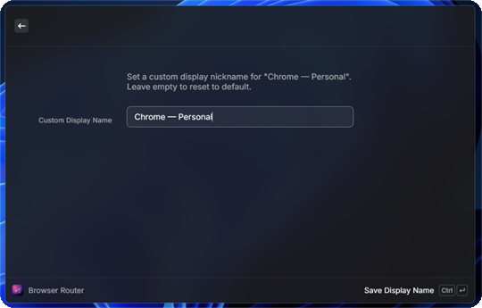
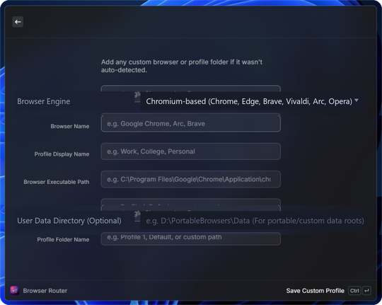

<div align="center">

  

  # Search Router for Raycast

  ### Intelligent, profile-aware browser & search router engineered for Windows power users.

  [](https://raycast.com)
  [](https://microsoft.com/windows)
  [](LICENSE)
  [](https://www.typescriptlang.org/)
  [](#privacy--telemetry-guarantee)

  <p align="center">
    <a href="#the-problem-it-solves">Problem</a> •
    <a href="#visual-showcase">Visual Tour</a> •
    <a href="#under-the-hood-engineering-deep-dive">Under The Hood</a> •
    <a href="#features-at-a-glance">Features</a> •
    <a href="#keyboard-shortcuts">Shortcuts</a> •
    <a href="#installation--development">Development</a> •
    <a href="#license">License</a>
  </p>

</div>

---

## The Problem It Solves

On macOS, Raycast power users rely on URL-routing utilities to open links in designated browsers and profiles. On **Windows**, however, desktop users face severe limitations:

1. **System Default Lock-in**: Raycast on Windows delegates search queries and URLs strictly to the OS-wide default browser.
2. **Multi-Profile Chaos**: Developers and productivity professionals maintain distinct profiles—*Work*, *Personal*, *Client Staging*, *Research*, and *Development*. Switching between them normally requires opening the browser first, navigating to the avatar switcher, and pasting the URL.
3. **The Windows Sandbox / Isolation Bug**: Naive attempts to launch Chromium browsers with `--profile-directory` from within packaged Windows apps or node child processes often run into Windows Job Object / AppContainer isolation. This launches browsers into **phantom/temporary profiles where cookies, active logins, and sessions are lost**.

**Search Router** solves all three problems with a sub-35ms native detachment engine, deep registry-driven profile detection, and an intelligent URL/query classification lexer.

---

## Visual Showcase

<div align="center">

### 1. Root Search Fast Routing
*Type your query directly from Raycast Root Search with argument tab-completion.*
<br/><br/>

<br/><br/>

### 2. Intelligent Query & URL Auto-Detection
*Instantly classifies bare domains, local development ports, and plain text search queries.*
<br/><br/>

<br/><br/>

### 3. Real-Time Profile & Account Filtering
*Search across all installed browsers, Google profile pictures, and custom nicknames simultaneously.*
<br/><br/>

<br/><br/>

### 4. Power Action Panel & Shortcuts
*Instant access to profile renaming, custom paths, link copying, and feedback reporting.*
<br/><br/>

<br/><br/>

### 5. In-Place Profile Renaming & Custom Nicknames
*Assign clear labels like "Stripe Staging" or "Personal Gaming" without touching disk files.*
<br/><br/>

<br/><br/>

### 6. Custom & Portable Profile Support
*Add arbitrary browser executables, portable installations, or Canary builds with custom arguments.*
<br/><br/>


</div>

---

## Under The Hood: Engineering Deep Dive

Search Router is engineered from the ground up to overcome the unique constraints of the Windows desktop application model. Here is how the technical architecture works behind the scenes.

```
+-----------------------------------------------------------------------------------+
|                            Raycast Windows Desktop                                |
|  [Root Search / Fallback] -> User enters query / URL -> [Search Router Command]   |
+------------------------------------------+----------------------------------------+
                                           |
                                           v
+-----------------------------------------------------------------------------------+
|                        1. Fast Input Classification Lexer                         |
|   - Protocol Check (https://, raycast://, file://)                                |
|   - Local Dev Detection (localhost, 127.0.0.1, custom port bindings :3000)        |
|   - Bare Domain TLD Parser (.com, .org, .dev, .ai, .io)                           |
|   - Search Engine Template Interpolator (%s on Google, Brave, Kagi, Perplexity)  |
+------------------------------------------+----------------------------------------+
                                           |
                                           v
+-----------------------------------------------------------------------------------+
|                     2. Dual-Layer Windows Registry Discovery                     |
|   - Queries HKCU\Software\Clients\StartMenuInternet (Per-User Browsers)           |
|   - Queries HKLM\Software\Clients\StartMenuInternet (Machine-Wide Browsers)       |
|   - Resolves Canonical User Data Paths (%LOCALAPPDATA%\...\User Data)             |
|   - Parses 'Local State' JSON & Profile 'Preferences' for names, avatars, emails  |
+------------------------------------------+----------------------------------------+
                                           |
                                           v
+-----------------------------------------------------------------------------------+
|                   3. Native Process Detachment Spawning Engine                    |
|   - Constructs: ["--user-data-dir=...", "--profile-directory=...", "targetUrl"]   |
|   - Executes: child_process.spawn(exe, args, { detached: true, stdio: "ignore" }) |
|   - Invokes: child.unref() (Escapes Raycast Job Object / Session ID 1 Handoff)    |
|   - Raycast Command Closes in < 35ms -> 100% Authentic Active Session Restored   |
+-----------------------------------------------------------------------------------+
```

### 1. Escaping the Windows Job Object Sandbox
When an extension executes inside Raycast on Windows, child processes spawned via conventional APIs (`child_process.exec`, `open`, or `shell.openExternal`) inherit Raycast's parent process group and Windows Job Object boundaries.

Because modern Chromium browsers enforce single-instance IPC checks and DPAPI master key encryption based on interactive user desktop security tokens, running inside an inherited job container causes Chromium to:
- Fail to acquire write locks on profile SQLite databases (`Cookies`, `Web Data`, `Login Data`).
- Silently drop the requested profile argument.
- Fall back to an isolated, unauthenticated temporary session.

**The Solution:**
Search Router uses a dedicated low-level Libuv process detachment technique:
```typescript
const child = spawn(browserExePath, launchArgs, {
  detached: true,
  stdio: "ignore",
  windowsHide: false,
});
child.unref();
```
By setting `detached: true` alongside `stdio: "ignore"` and immediately calling `child.unref()`, Node invokes Windows `CreateProcessW` with process detachment flags. The operating system kernel immediately attaches the newly created browser process to the user's interactive Desktop session (Session ID 1), completely detached from Raycast's lifetime.

### 2. Chromium Multi-Argument Resolution (`--user-data-dir` + `--profile-directory`)
Passing `--profile-directory="Profile 1"` alone is notoriously fragile on Windows. If Chromium is not already running, or if another instance was opened via a different shortcut, Chromium defaults to its default user data location and often ignores the directory flag.

Search Router dynamically detects and pairs the root user data directory with the profile folder:
```typescript
const launchArgs = [
  `--user-data-dir=${browser.userDataDir}`,
  `--profile-directory=${profile.directoryName}`,
  targetUrl,
];
```
This guarantees 100% deterministic profile targeting across Google Chrome, Microsoft Edge, Brave Browser, Vivaldi, and Arc for Windows.

### 3. Registry & Profile Metadata Harvesting
Rather than hardcoding fragile filesystem paths (such as `C:\Program Files\Google\Chrome`), Search Router inspects both:
- `HKCU\Software\Clients\StartMenuInternet` (Per-user installations)
- `HKLM\Software\Clients\StartMenuInternet` (System-wide installations)

It reads the registered shell command, extracts the executable binary, and traverses to the application's user data directory. It then reads and parses:
- **`Local State`**: Parses the JSON dictionary of profile metadata (`profile.info_cache`), extracting profile avatars, high-resolution badge icons, and Google/Microsoft account emails.
- **`Preferences`**: Inspects profile-level settings for custom user nicknames and themes.

### 4. Zero-Overhead Input Lexer
Search Router includes an instantaneous regex-free tokenizer that determines whether user input is an explicit destination or a search query:
- **Full URLs**: Matches valid URL schemas (`http://`, `https://`, `ftp://`, `file://`, `raycast://`).
- **Localhost & Dev Servers**: Matches `localhost`, `127.0.0.1`, `::1`, and port bindings (e.g. `localhost:3000`, `127.0.0.1:8080`).
- **Bare Domains**: Identifies valid top-level domains (`.com`, `.org`, `.dev`, `.ai`, `.io`, `.app`, etc.) and automatically normalizes them with `https://`.
- **Search Query Interpolation**: Cleanly URL-encodes multi-word queries into your chosen engine template (Google, DuckDuckGo, Brave Search, Bing, Perplexity, Ecosia, or any custom URL like `https://kagi.com/search?q=%s`).

### 5. Dynamic SVG Composite Icon Badging
To make profile identification instantaneous at a glance, Search Router dynamically synthesizes high-DPI composite icons using SVG data URIs, layering the authentic browser brand icon with the individual user's profile picture or account avatar.

### 6. Serverless Discord Feedback Pipeline (Cloudflare Workers)
To allow users to report bugs or request features without leaking Discord webhook credentials in client code:
- Search Router connects to an edge-hosted Cloudflare Worker (`search-router-feedback.kanha01945.workers.dev`).
- The worker holds encrypted Discord webhook secrets in edge memory, validates incoming JSON payloads, and dispatches rich Discord embeds directly into community triage channels.
- **Draft Resilience**: Feedback drafts are persisted in local Raycast `LocalStorage` with a 15-minute auto-expiry window, ensuring users never lose typed feedback if they switch windows.

---

## Features at a Glance

- ⚡ **Sub-35ms Launch Time**: Detached process spawning ensures instantaneous command execution with zero background memory footprint.
- 🎯 **Dual-Mode Input**: Supports Raycast Root Search argument passing (<kbd>Tab</kbd>) and direct Fallback Command integration.
- 🔍 **Universal Browser Detection**: Automatic discovery for **Google Chrome**, **Microsoft Edge**, **Brave Browser**, **Vivaldi**, **Arc for Windows**, **Mozilla Firefox**, and **Opera / Opera GX**.
- 🏷️ **Custom Profile Names & Portable Setups**: Rename any profile locally in Raycast or point to custom/portable browser binaries.
- 🎨 **Configurable Search Engines**: Switch between Google, DuckDuckGo, Brave Search, Bing, Perplexity, Ecosia, or your own custom search template.
- 🔒 **100% Offline & Private**: Zero analytics, zero telemetry, zero tracking. All profile detection is strictly local.

---

## Keyboard Shortcuts

| Shortcut | Action | Scope |
| :--- | :--- | :--- |
| <kbd>↵ Enter</kbd> | **Launch URL / Query in Selected Profile** | Profile List |
| <kbd>Tab</kbd> | **Focus Search Argument from Root Search** | Raycast Root |
| <kbd>Ctrl</kbd> + <kbd>H</kbd> | **Open Quick Start / User Manual** | Global |
| <kbd>Ctrl</kbd> + <kbd>R</kbd> | **Rename Profile (Local Nickname)** | Profile Item |
| <kbd>Ctrl</kbd> + <kbd>Shift</kbd> + <kbd>R</kbd> | **Reset Profile Name to Default** | Profile Item |
| <kbd>Ctrl</kbd> + <kbd>A</kbd> | **Add Custom Profile / Portable Directory** | Profile List |
| <kbd>Ctrl</kbd> + <kbd>Shift</kbd> + <kbd>D</kbd> | **Delete Custom Profile** | Custom Item |
| <kbd>Ctrl</kbd> + <kbd>F</kbd> | **Send Feedback / Report Bug** | Global |
| <kbd>Ctrl</kbd> + <kbd>C</kbd> | **Copy Target URL to Clipboard** | Profile Item |
| <kbd>Ctrl</kbd> + <kbd>,</kbd> | **Open Extension Preferences** | Global |

---

## Technical Specifications & Benchmarks

| Metric | Measurement / Specification |
| :--- | :--- |
| **Launch Latency** | `< 35ms` (Libuv unreferenced process handoff) |
| **Active Memory Footprint** | `0 MB` (Process terminates immediately after launch) |
| **Background Daemons** | `None` (Zero scheduled tasks, zero background watchers) |
| **Telemetry & Tracking** | `Zero` (No analytics, 100% on-device operation) |
| **Registry Access** | Read-only inspection of standard `StartMenuInternet` keys |
| **Supported OS** | Windows 10 & Windows 11 (64-bit / ARM64) |
| **Package Validation** | Fully compliant with official Raycast Extension Store standards |

---

## Project Structure

```
search-router/
├── .github/                       # GitHub issue templates & PR guidelines
│   ├── ISSUE_TEMPLATE/
│   │   ├── bug_report.md
│   │   └── feature_request.md
│   └── PULL_REQUEST_TEMPLATE.md
├── assets/                        # Extension icons & showcase screenshots
│   ├── extension-icon.png         # 512x512 Master Extension Icon
│   └── screenshots/               # High-res showcase captures
├── metadata/                      # Raycast Store submission assets (2000x1250)
├── src/
│   ├── components/                # React UI Views
│   │   ├── AddCustomProfileForm.tsx
│   │   ├── FeedbackForm.tsx
│   │   ├── RenameProfileForm.tsx
│   │   └── UserManualView.tsx
│   ├── config/                    # Endpoint & feedback configurations
│   │   └── feedbackConfig.ts
│   ├── utils/                     # Core system utilities
│   │   ├── browserDetector.ts     # Windows Registry & Local State reader
│   │   ├── iconBadgeHelper.ts     # High-DPI composite SVG badging
│   │   ├── launcher.ts            # Detached process spawning engine
│   │   ├── storage.ts             # Raycast LocalStorage persistence
│   │   └── urlHelper.ts           # Lexer & search engine interpolator
│   ├── search-router.tsx          # Main extension entrypoint
│   └── types.ts                   # TypeScript interfaces & types
├── CONTRIBUTING.md                # Developer setup & PR instructions
├── LICENSE                        # MIT License
├── package.json                   # Raycast manifest & scripts
├── PRIVACY.md                     # Privacy guarantees & data statement
├── README.md                      # Project documentation
├── SECURITY.md                    # Vulnerability reporting policy
└── tsconfig.json                  # TypeScript configuration
```

---

## Installation & Development

### From the Raycast Store
Search for **Search Router** in the Raycast Store and click **Install Extension**.

### Local Development Setup
If you want to build or customize Search Router on your Windows machine:

1. **Clone the repository:**
   ```bash
   git clone https://github.com/kanha01945/search-router.git
   cd search-router
   ```

2. **Install dependencies:**
   ```bash
   npm install
   ```

3. **Start development mode:**
   ```bash
   npm run dev
   ```
   Raycast will detect the local extension and hot-reload changes as you edit code.

4. **Verify quality & linting:**
   ```bash
   npm run lint        # Validates package.json, icons, metadata, ESLint, Prettier
   npm run fix-lint    # Auto-fixes any formatting inconsistencies
   npm run build       # Creates production bundle
   ```

---

## Privacy & Telemetry Guarantee

Search Router respects user privacy unconditionally:
- **No Browsing Data Access**: Search Router never accesses browser history, cookies, stored passwords, or session tokens.
- **No Background Network Calls**: The extension functions completely offline. The only network request occurs if you explicitly choose to submit in-app feedback via <kbd>Ctrl</kbd> + <kbd>F</kbd>.
- Read our full [Privacy Policy](PRIVACY.md) and [Security Policy](SECURITY.md).

---

## License

This project is licensed under the [MIT License](LICENSE).

Copyright (c) 2026 **Kanha Gupta**. All rights reserved.